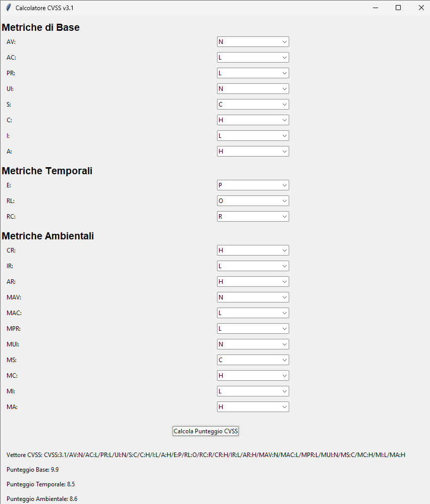

# CVSS Calculator


## Descrizione

**CVSS Calculator** è un'applicazione desktop sviluppata in Python utilizzando la libreria Tkinter. Questo strumento permette di calcolare facilmente il punteggio CVSS (Common Vulnerability Scoring System) versione 3.1, fornendo una valutazione dettagliata della gravità delle vulnerabilità di sicurezza.

## Caratteristiche

- **Interfaccia Intuitiva**: Utilizza menu per selezionare le metriche CVSS.
- **Calcolo Completo**: Supporta le metriche di base, temporali e ambientali del CVSS v3.1.
- **Risultati Dettagliati**: Visualizza il vettore CVSS, i punteggi base, temporali e ambientali.
- **Validazione Input**: Gestisce errori di input e fornisce messaggi di errore chiari.

## Anteprima



## Installazione

### Requisiti

- **Python 3.6+**: Assicurati di avere Python installato sul tuo sistema.
- **Librerie Python**:
  - `tkinter` (in genere incluso con Python)
  - `cvss==3.2`

### Passaggi

1. **Clona il Repository**

   ```bash
   git clone https://github.com/francescobrina/cvss_calculator.git
   cd cvss_calculator
   ```

2. **Crea un Ambiente Virtuale (Opzionale ma Consigliato)**

   ```bash
   python -m venv venv
   source venv/bin/activate  # Su Windows: venv\Scripts\activate
   ```

3. **Installa le Dipendenze**

   Assicurati di avere il file `requirements.txt` con il seguente contenuto:

   ```plaintext
   cvss==3.2
   ```

   Poi esegui:

   ```bash
   pip install -r requirements.txt
   ```

   *Se non hai un file `requirements.txt`, puoi installare le dipendenze manualmente:*

   ```bash
   pip install cvss==3.2
   ```

4. **Esegui l'Applicazione**

   ```bash
   python cvss_calculator.py
   ```

## Utilizzo

1. **Seleziona le Metriche**

   Utilizza i menu a tendina per selezionare i valori delle metriche di base, temporali e ambientali secondo le specifiche del CVSS v3.1.

2. **Calcola il Punteggio**

   Clicca sul pulsante "Calcola Punteggio CVSS" per ottenere il vettore CVSS completo e i punteggi associati.

3. **Visualizza i Risultati**

   I risultati verranno mostrati nell'interfaccia, inclusi il vettore CVSS, i punteggi base, temporali e ambientali, e la gravità complessiva.

## Contribuire

Se desideri contribuire a **CVSS Calculator**, segui questi passaggi:

1. **Fork del Repository**
2. **Crea un Branch** (`git checkout -b feature/nome-feature`)
3. **Commit delle Modifiche** (`git commit -m 'Aggiungi nuova feature'`)
4. **Push al Branch** (`git push origin feature/nome-feature`)
5. **Apri una Pull Request**

## Licenza

Questo progetto è rilasciato sotto la licenza [LGPLv3+](LICENSE).

## Autore

- **Francesco Brina** - [francescobrina](https://github.com/francescobrina)
- **Email**: [francecobrina9@gmail.com](mailto:francecobrina9@gmail.com)

## Riconoscimenti

- Grazie a [CVSS Python Library](https://github.com/RedHatProductSecurity/cvss) per la gestione del calcolo CVSS.
- Grazie a [Tkinter](https://docs.python.org/3/library/tkinter.html) per l'interfaccia grafica.

---

